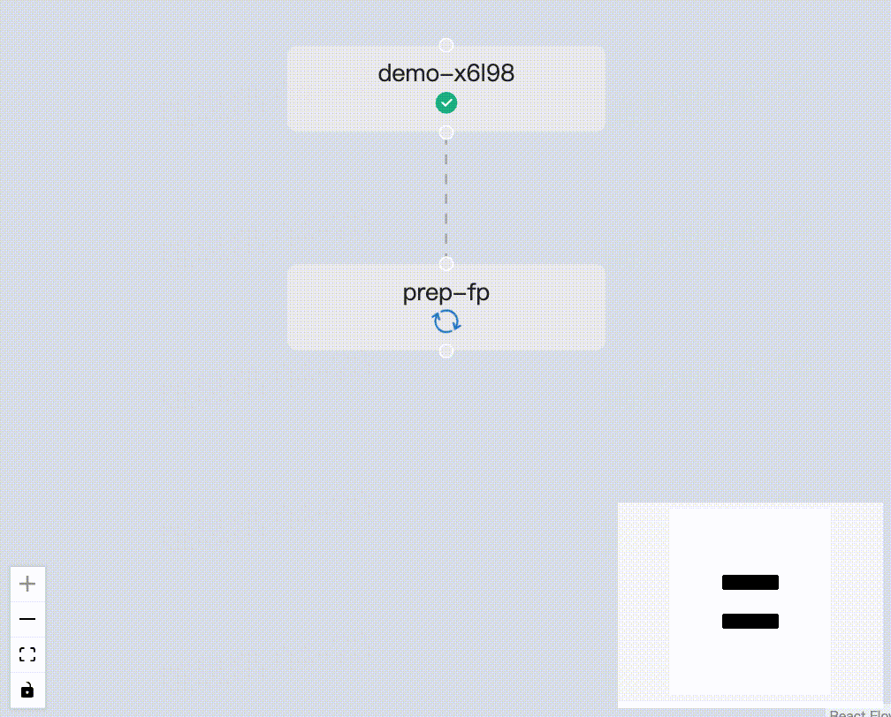

# Streamlit flow

Streamlit flow allows one to easily display Argo workflow nodes. It supports the node phases “success”, “failed”, “running”, “pending”.

## Install
```
bash build.sh
pip install .
```

## Usage
```
import json
from streamlit_flow.argo_workflow import st_argo_workflow

# one can get this data through the argo workflow api
# '/api/v1/workflows/{namespace}/{id}'
# or '/api/v1/archived-workflows/{uid}'
data = json.load(open('example_data.json'))
st_argo_workflow(data, height=800, width="100%")
```

