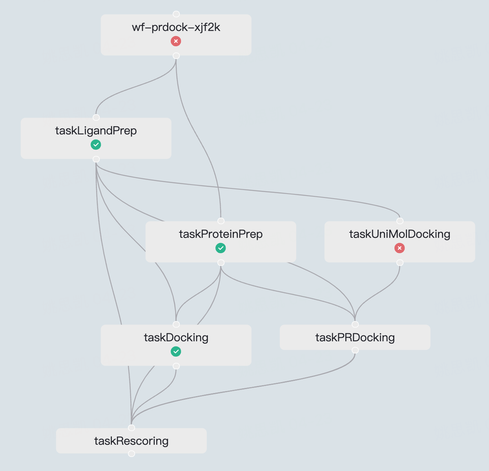

# Streamlit flow

Streamlit flow allows one to easily display Argo workflow nodes.

## Install
```
pip install streamlit-flow
```

## Usage
```
import json
from streamlit_flow.argo_workflow import st_argo_workflow

data = json.load(open('example_data.json'))
st_argo_workflow(data, height=800, width="100%")
```
